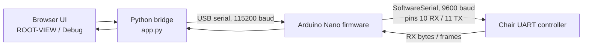

# AI CODEX — Electric Chair Bridge

A minimalist web + firmware bridge for a reverse-engineered **massage chair UART interface**.

> The project name says “Electric Chair,” but the code and protocol notes are for a massage-chair style controller: power, massage zones, timer, heat, speed, intensity, reclining, and “zero gravity” style chair commands.

## What it does

This repository connects three pieces:



The browser sends command names such as `power`, `ogrzewanie`, or `masaz_stop`.  
The Python bridge forwards those names over USB serial.  
The Arduino firmware maps each command name to the single-byte code expected by the chair interface.

The bridge also listens to `RX: 0x..` logs from the firmware, reconstructs chair frames, and uses them to keep the web display state in sync.

## Repository layout

```text
.
├── app.py                          # Python HTTP + serial bridge
├── ROOT-VIEW.html                  # Main touch-panel style UI shell
├── ElectricChair_TouchPanel_WEB.html
├── massage_display_interface.svg   # Reverse-engineered display SVG
├── static/                         # CSS, JS, debug view, compact UI
├── electric_chair_firmware/         # PlatformIO Arduino Nano project
│   ├── platformio.ini
│   └── src/main.cpp
├── docs/
│   ├── ORIGINAL_README.md
│   ├── display-touchpanel-behavior.pl.txt
│   ├── massage-chair-uart-protocol-v1.txt
│   ├── ARCHITECTURE.md
│   └── PROJECT_AUDIT.md
├── requirements.txt
├── Makefile
└── .gitignore
```

Generated PlatformIO build outputs, Python bytecode, local editor settings, and local assistant config were intentionally removed from this GitHub package.

## Requirements

### Python bridge

- Python 3.10+
- `pyserial`
- `qrcode` for the optional `/qr.svg` LAN helper

Install:

```bash
python -m venv .venv
source .venv/bin/activate
pip install -r requirements.txt
```

On Windows PowerShell:

```powershell
py -m venv .venv
.venv\Scripts\Activate.ps1
pip install -r requirements.txt
```

### Firmware

- PlatformIO
- Arduino Nano / ATmega328P new bootloader target
- Chair UART wired to the firmware’s `SoftwareSerial` pins:
  - pin `10` = RX
  - pin `11` = TX
  - chair UART baud = `9600`
- USB serial monitor / bridge baud = `115200`

## Flash the firmware

```bash
cd electric_chair_firmware
platformio run
platformio run -t upload
platformio device monitor -b 115200
```

The firmware accepts command names on USB serial and prints status lines such as:

```text
Ready. Type a command name and press Enter.
Controls: listen | listen on | listen off | listen toggle
Queued: power -> 0x01
[12345] RX: 0x04
```

## Run the web bridge

From the repository root:

```bash
python app.py
```

With explicit host, port, and serial device:

```bash
python app.py --host 0.0.0.0 --port 8080 --serial-port /dev/ttyACM0
```

Common serial examples:

```bash
python app.py --serial-port /dev/ttyACM0   # Linux
python app.py --serial-port /dev/cu.usbmodemXXXX   # macOS
python app.py --serial-port COM3           # Windows
```

The bridge also reads these environment variables:

```text
CHAIR_BRIDGE_HOST
CHAIR_BRIDGE_HTTP_PORT
CHAIR_BRIDGE_SERIAL_PORT
CHAIR_BRIDGE_BAUD
```

Open:

```text
http://localhost:8080/
```

Useful routes:

| Route | Purpose |
|---|---|
| `/` | Main touch-panel UI |
| `/debug` | Debug UI with state, logs, and frame details |
| `/network` | LAN helper page |
| `/qr.svg` | QR code for the LAN URL, if `qrcode` is installed |
| `/display.svg` | Served display SVG with layer metadata |
| `/api/state` | Current bridge/UI/chair state as JSON |
| `/api/command` | POST endpoint for command dispatch |

Example API command:

```bash
curl -X POST http://localhost:8080/api/command \
  -H "Content-Type: application/json" \
  -d '{"command":"power"}'
```

## Command map

<details>
<summary>Supported command names and byte codes</summary>

| Command | Code | Label |
|---|---:|---|
| `power` | `0x01` | Power |
| `predkosc_masazu_stop` | `0x02` | Foot massage speed |
| `ogrzewanie` | `0x03` | Heating |
| `masaz_calego_ciala` | `0x04` | Full-body massage |
| `tryb_automatyczny` | `0x05` | Automatic mode |
| `oparcie_w_dol` | `0x06` | Backrest down |
| `czas` | `0x07` | Timer |
| `grawitacja_zero` | `0x08` | Zero gravity |
| `oparcie_w_gore` | `0x09` | Backrest up |
| `pauza` | `0x0B` | Pause |
| `masaz_stop` | `0x0D` | Foot massage |
| `masaz_posladkow` | `0x0E` | Seat / buttocks massage |
| `sila_nacisku_minus` | `0x0F` | Intensity down |
| `sila_nacisku_plus` | `0x10` | Intensity up |
| `nogi` | `0x11` | Legs |
| `przedramiona` | `0x12` | Forearms |
| `ramiona` | `0x13` | Shoulders |
| `predkosc_minus` | `0x14` | Speed down |
| `predkosc_plus` | `0x15` | Speed up |
| `do_przodu_do_tylu_1` | `0x16` | Forward/back 1 |
| `plecy_i_talia` | `0x17` | Back and waist |
| `do_przodu_do_tylu_2` | `0x18` | Forward/back 2 |
| `szyja` | `0x19` | Neck |

</details>

## How the runtime works

1. `app.py` starts a threaded HTTP server and a background serial worker.
2. The serial worker finds or opens the Arduino USB port at `115200`.
3. On startup it sends `listen on` so the firmware begins forwarding chair RX bytes.
4. The UI polls `GET /api/state`.
5. Button clicks call `POST /api/command` with a command name.
6. The Python bridge updates its local semantic model and queues the command.
7. The firmware receives the name, maps it to a byte, and writes that byte to the chair UART.
8. RX logs are parsed back into frame/state hints for the display.

## Safety notes

This project interacts with real hardware that may move, heat, or pinch. Keep the original chair controls accessible, test without a person seated first, and do not connect the Arduino to mains or high-voltage circuits. Verify signal voltage levels, ground reference, and isolation before connecting anything to the chair controller.

The HTTP bridge has no authentication. Bind it to `127.0.0.1` unless you deliberately want LAN access.

## Development

Quick commands:

```bash
make setup
make run
make firmware-build
make firmware-upload
```

Python syntax check:

```bash
python -m py_compile app.py
```

Firmware build:

```bash
cd electric_chair_firmware
platformio run
```

## Docs

- `docs/ARCHITECTURE.md` — deeper technical walkthrough
- `docs/PROJECT_AUDIT.md` — what was cleaned from the original archive
- `docs/display-touchpanel-behavior.pl.txt` — original Polish UI behavior notes
- `docs/massage-chair-uart-protocol-v1.txt` — reverse-engineered UART protocol notes

## License

No license was included in the uploaded archive. Until the project owner chooses one, treat this repository as **all rights reserved**.
